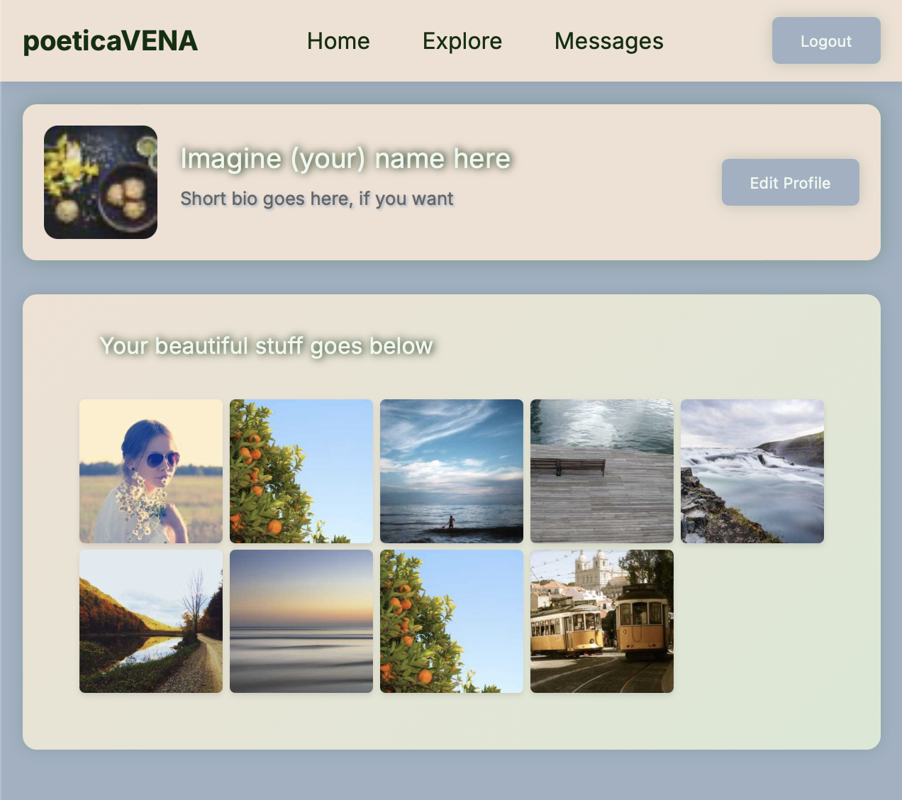

# Profile Page Project
A mobile-first profile page built with Semantic HTML, BEM CSS, and JavaScript.

## Project Overview
Build a simplified Instagram clone that will evolve through different technologies per sprint:

1. Start with static HTML/CSS
2. Progress to a React SPA
3. Add a Fastify API backend
4. Migrate the frontend to Remix
    1. Use Nginx as a reverse proxy to serve both applications on an aws linux instance
